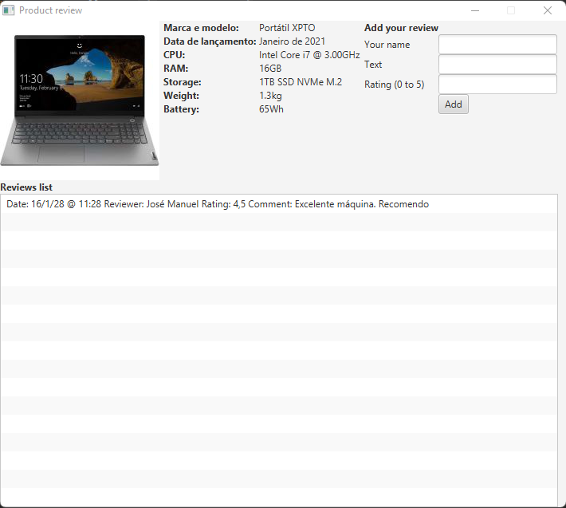

# Advanced Programming | Lab9

## Objectives
- Identification of bad smells in the code and respective refactoring
- Creation of unit tests

## 1 - Introduction

The *refactoring* process is the process of changing a *software* program, by improving its internal structure (design), without changing its behavior. This process improves the design of the *software* program, makes the code more efficient, easier to maintain, and – therefore – makes the code easier to understand, because in most *software* development environments, other people who have not developed the code they will have to read it.

This laboratory is intended for the student to identify the *bad smells* existing in the code and apply the appropriate *refactoring* techniques, in order to promote the development of “clean” code. Combining theoretical-practical literature, we suggest reading the existing content at https://refactoring.guru/refactoring/smells. It may also be useful to consult the IntelliJ IDEA documentation on the *refactoring* features provided by the IDE that may facilitate and speed up some of the operations to be performed: https://www.jetbrains.com/help/idea/refactoring-source-code .html

The project is based on a simple tool for publishing *reviews* about a given product. The user is only asked to enter *reviews*, in order to populate a list of this type.

Figure 1 - Example of the graphical interface

## 2 - Exercises

1. Level 1: The **Review** class presents a *bad smell* of the *data clump* type.
   1. Identify it and do the appropriate *refactoring* to solve the problem;
   2. Confirm the correctness of the previous change by creating and running an appropriate unit test.
2. Level 2: The **MainGUI** class has a *bad smell* of the *duplicate code* type.
   1. Apply the *Extract Method* technique in order to resolve the *duplicate code* found in the *start* method.
3. Level 3: The **MainGUI** class has a *bad smell* of the *long method* type.
   1. Apply the *Extract Method* technique in order to resolve the *long method* in the *start* method by breaking it into several methods.
4. Level 4: The **Reviews** class has two *bad smells*.
   1. Identify them and create the unit test that validates the total number of reviews;
   2. Carry out the appropriate *refactoring* citing the techniques used (suggestion for one of them: *Replace Inheritance with Delegation*);
   3. Confirm the correctness of the previous change by running the unit test.
5. Level 5
   1. Apply the *Extract Class* technique in order to extract the user interface responsibility to a class called **GUIReviews**.

(end of statement)